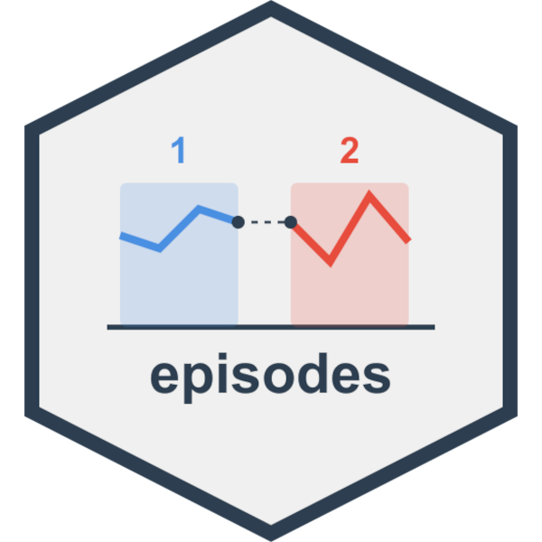

# episodes 

Segment longitudinal data into meaningful episodes based on temporal gaps and variable changes. It's designed for analyzing treatment patterns, patient journeys, and other time series data where interruptions and changes in covariates are significant. This tool is useful for survival analyses and other time-varying statistical methods requiring structured temporal data.

Features:

-   Identify episodes based on gaps between dates
-   Track how variables change within episodes
-   Analyze retention across specified time thresholds
-   Support for grouped data workflows in the tidyverse style

## Installation

From CRAN:

``` r
install.packages("episodes")
```

Development version:

``` r
# install.packages("pak")
pak::pak("dylanpieper/episodes")
```

## Basic Usage

### Segmenting client treatment episodes

``` r
library(episodes)

episodes <- substance_use |>
  group_by(client_id) |>
  segment_episodes(
    visit_date,
    gap_threshold = 2,
    gap_unit = "months"
  )

retention <- treatment_episodes |>
  split_episode(
    thresholds = c(30, 90, 180), 
    units = "days"
  )
```

### Including covariate changes

Track when important variables change within episodes using `segment_episodes_by_covars()`:

``` r
episodes_by_covars <- substance_use |>
  group_by(client_id) |>
  segment_episodes_by_covars(
    visit_date,
    covar_cols = c("substance_use_past_week", 
                   "quality_of_life_score", 
                   "medication_dose_mg"),
    gap_threshold = 2,
    gap_unit = "months"
  ) |>
  arrange(client_id, episode_id, segment_id)
```

## Features

### Identifying active vs. inactive episodes

By default, `segment_episodes()` classifies episodes as:

-   **Active**: Recent episodes (based on `inactive_threshold`)
-   **Inactive**: Episodes that ended before the inactive threshold
-   **Gap**: Episodes that are followed by another episode

``` r
status_check <- substance_use |>
  group_by(client_id) |>
  segment_episodes(
    visit_date, 
    gap_threshold = 2, 
    gap_unit = "months",
    inactive_threshold = 3,
    inactive_unit = "months"
  ) |>
  count(status)
```

### Handling fixed and varying variables

The package automatically distinguishes between:

-   Fixed variables (same value throughout a group)
-   Varying variables (values change within a group)

Fixed variables are included in the results, while varying variables are excluded. Use `segment_episodes_by_covars()` to track changes in specific variables.

## Dataset

The package includes a simulated substance use treatment dataset:

``` r
glimpse(substance_use)
```
