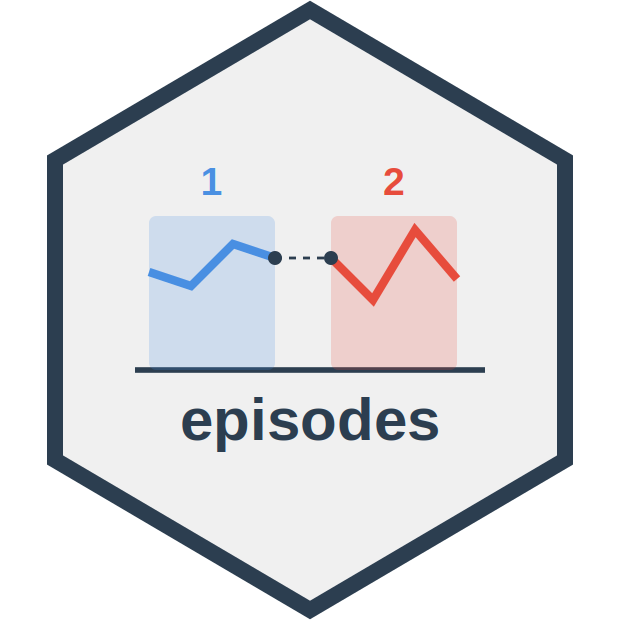

# episodes 

[](https://github.com/dylanpieper/episodes/actions/workflows/R-CMD-check.yaml)

Segment longitudinal data into meaningful episodes based on temporal gaps and variable changes. It's designed for analyzing treatment patterns, patient journeys, and other time series data where interruptions and changes in covariates are significant. This tool is useful for survival analyses and other time-varying statistical methods requiring structured temporal data.

Features:

-   Identify episodes based on gaps between dates
-   Track how variables change within episodes
-   Analyze continuation (i.e., retention) across episodes
-   Support for grouped data workflows in the tidyverse style
-   Track progress during long-running operations on large datasets

## Installation

From CRAN:

``` r
install.packages("episodes")
```

Development version:

``` r
# install.packages("pak")
pak::pak("dylanpieper/episodes")
```

## Basic Usage

### Segmenting client treatment episodes

``` r
library(episodes)

episodes <- substance_use |>
  group_by(client_id) |>
  segment_episodes(
    visit_date,
    gap_threshold = 2,
    gap_unit = "months"
  )
```

Additional fixed variables are included in the results, while varying variables are excluded. Use `segment_episodes_by_covars()` to track changes in specific variables.

### Identifying active vs. inactive episodes

By default, `segment_episodes()` assigns the status of episodes as:

-   **Active**: Recent episodes (based on `inactive_threshold`)
-   **Inactive**: Episodes that ended before the inactive threshold
-   **Gap**: Episodes that are followed by another episode

``` r
status_check <- substance_use |>
  group_by(client_id) |>
  segment_episodes(
    visit_date, 
    gap_threshold = 2, 
    gap_unit = "months",
    inactive_threshold = 3,
    inactive_unit = "months"
  ) |>
  count(status)
```

### Including covariate changes

Track when important variables change within episodes using `segment_episodes_by_covars()`:

``` r
episodes_by_covars <- substance_use |>
  group_by(client_id) |>
  segment_episodes_by_covars(
    visit_date,
    covar_cols = c("substance_use_past_week", 
                   "quality_of_life_score", 
                   "medication_dose_mg"),
    gap_threshold = 2,
    gap_unit = "months"
  ) |>
  arrange(client_id, episode_id, segment_id)
```

An additional status for **ongoing** episodes is included for the segmentation of episodes by changes in the covariates.

### Analyzing continuation (i.e., retention)

The `split_episode()` function helps analyze whether episodes continue past specific time thresholds:

``` r
retention <- episodes |>
  split_episode(
    thresholds = c(30, 12, 6), 
    units = c("days", "weeks", "months")
  )
```

The function adds columns for each threshold: - `*_date`: The date corresponding to threshold after episode start - `*_eligible`: Whether enough time has passed to evaluate this threshold - `*_continued`: Whether the episode continued past this threshold

## Dataset

The package includes a simulated substance use treatment dataset:

``` r
glimpse(substance_use)
```
